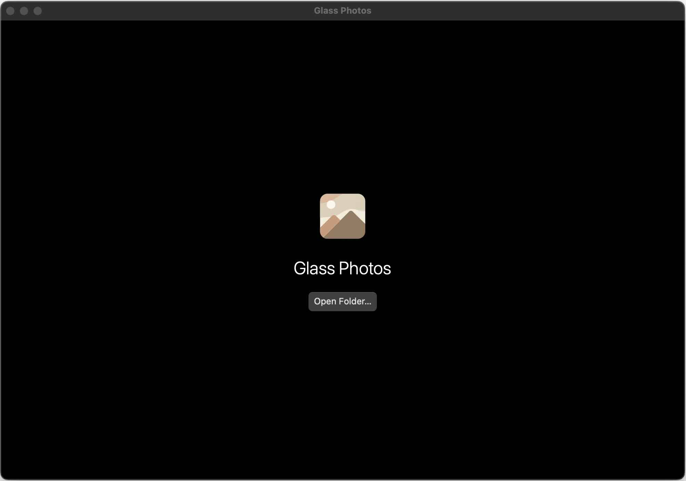
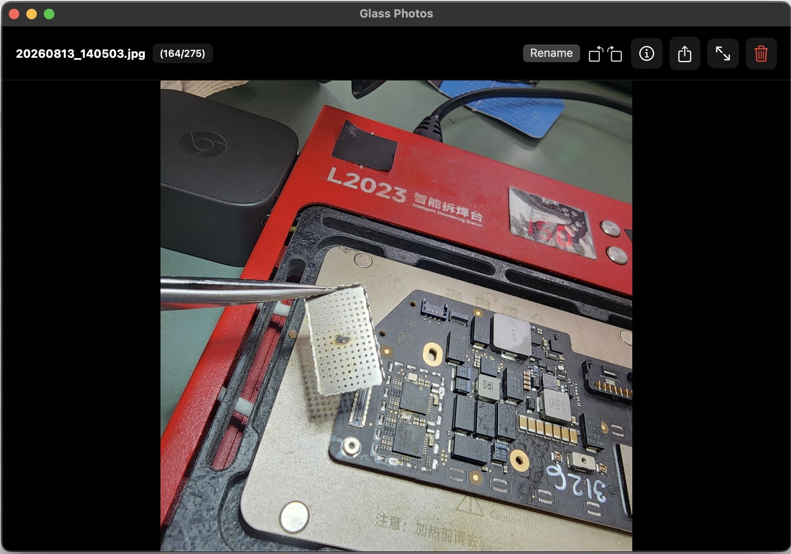
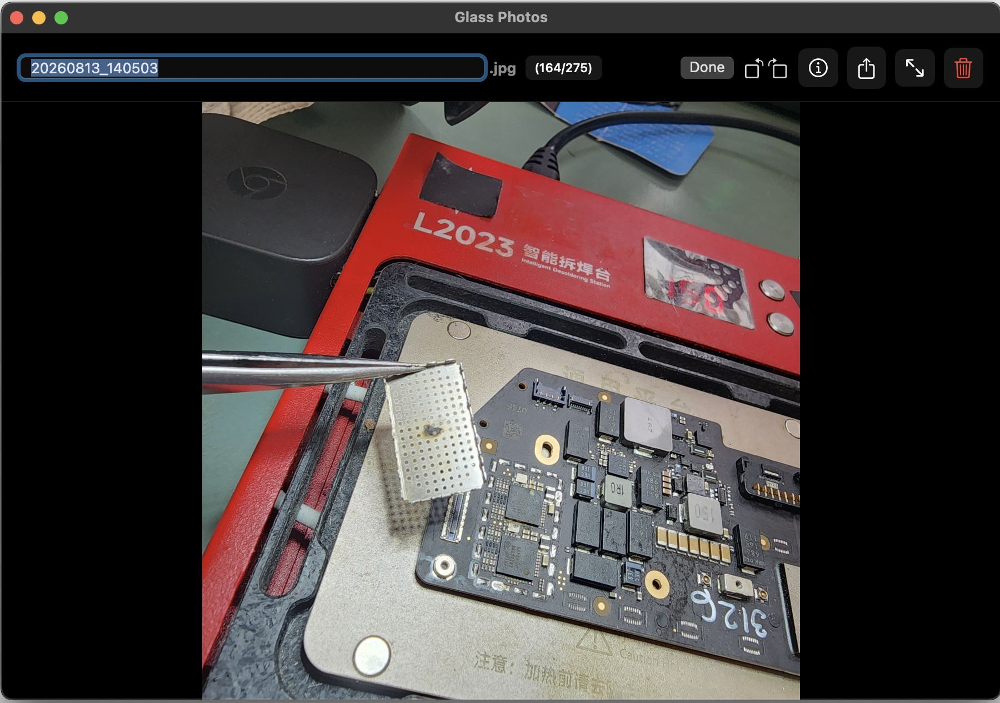
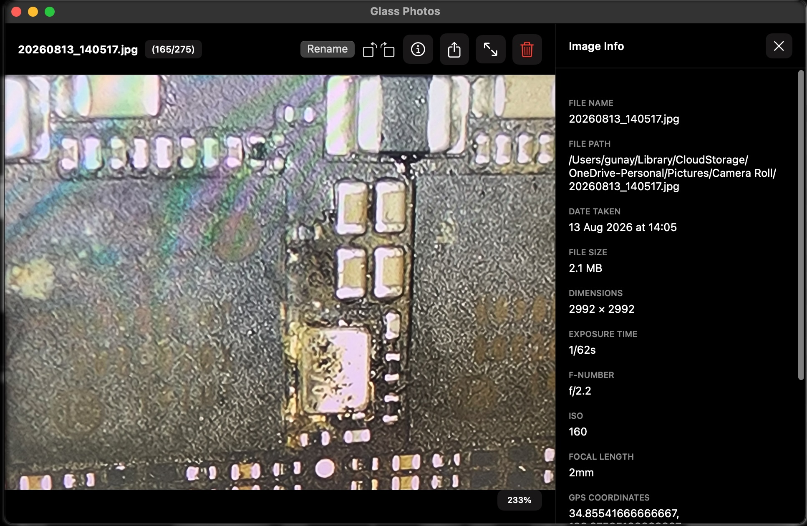
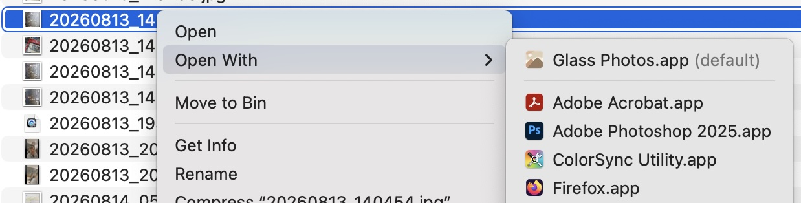
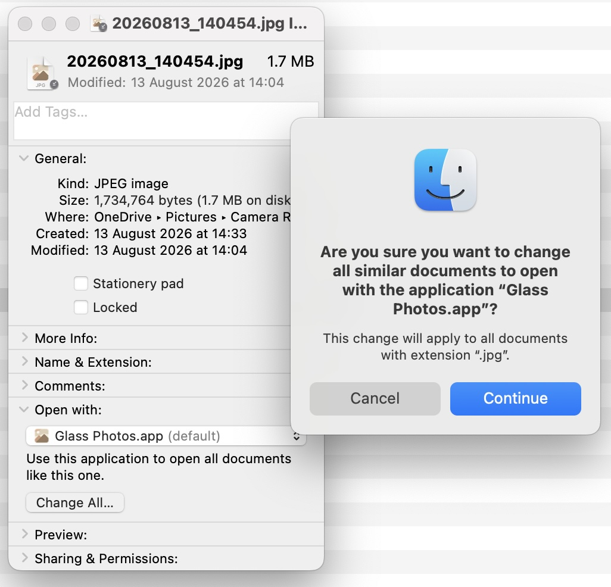

#  Glass Photos Viewer

A beautiful, modern photo viewer for macOS with a focus on simplicity and performance.

A fast, Windows-style photo viewer for macOS that lets you browse with the arrow keys and rotate, rename, or move photos to the Trash.

## Screenshots

## Features

### 🖼️ **Open with Photos by Default**

- **File type associations** - double-click any image file to open it in the app
- **Open folders** - quickly open folders
- **Fullscreen mode**: Perfect for photo presentations or immersive viewing

### 📚 Associate as the default viewer for a file type

- Right-click an image in Finder and choose **Get Info**
- Under **Open with**, choose **Glass Photos.app**
- Press **Change All…**
- Confirm the selection

### 🎯 **Easy Navigation**
- **Keyboard shortcuts**:
  - `←` / `→` - Navigate between photos
  - `↑` - Rotate a photo 90° counter-clockwise (saves automatically)
  - `↓` - Rotate a photo 90° clockwise (saves automatically)
  - `Space` - Toggle fit to window
  - `F` - Toggle fullscreen
  - `Esc` - Exit fullscreen
  - `Cmd+O` - Open folder
  - `Backspace/Delete` - Move the photo to the Trash after confirmation
  - `Enter/Return` - Rename photo

- **Mouse/Trackpad**:
  - **Double-click** - Zoom In/Zoom Out
  - **Pinch** - Pinch to Zoom In/Zoom Out
  - **Drag and Pan** - Move inside the zoomed photo

### 🚀 **Performance**
- **Smart caching** - Images are cached for smooth navigation
- **Background loading** - Photos load in the background for better performance
- **Preloading** - Adjacent images are preloaded for instant navigation

### 📁 **Supported Formats**
- **Common formats**: JPG, JPEG, PNG, WebP, HEIC, HEIF, TIFF, GIF, BMP
- **RAW formats**: DNG, NEF, CR2, ARW, RAF

## How to Use

### Opening Photos
1. **Launch the app** - Use the button to open a folder
2. **Double-click any associated image file** - The app opens that image and loads neighboring photos from its folder
3. **Use the menu** - File → Open Folder to browse for photos

### Navigation
- Use arrow keys to navigate between photos
- Press Space to toggle between fit-to-window and actual size
- Press F to enter/exit fullscreen mode

## Installation

### Quick Download
Download the latest build from the [Glass Photos releases](https://github.com/GunayAnach/mac-photo-viewer/releases/latest).

### 🌍 From GitHub Releases
- Download the latest ZIP from the [releases section](https://github.com/GunayAnach/mac-photo-viewer/releases)
- Extract it and drag **Glass Photos.app** to the Applications folder
- The beta builds are unsigned; right-click the app and choose **Open** the first time

## Bugs or Issues?
Open a ticket under [Issues](https://github.com/GunayAnach/mac-photo-viewer/issues).
- Describe what is not working and which macOS version you are using
- Explain step by step how the problem can be reproduced

## Development
Suggestions or improvements? Feel free to fork the project, implement the change, and create a pull request.
1. Clone the project
2. Build the project in Xcode

## System Requirements

- macOS 15.5 or later
- SwiftUI 4.0+
- 4GB RAM recommended for large photo collections

## Tips

- **Large folders**: The app handles large photo collections efficiently with background loading
- **RAW files**: RAW format support for professional photographers
- **Fullscreen mode**: Perfect for photo presentations or immersive viewing
- **Keyboard shortcuts**: Learn the shortcuts for the fastest workflow

Enjoy viewing your photos with Glass Photo Viewer! 📸
